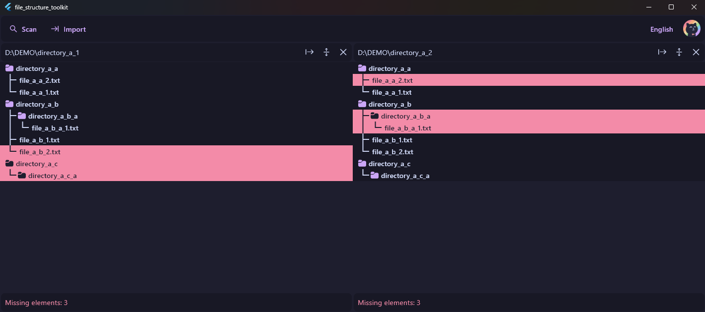

# File Structure Toolkit

My personal utility for scanning, exporting to file and comparing file structures.

## Features

- Display a full tree structure of a directory.
- Compare several tree structures side-by-side.
- Export the tree structure to a `.tree` file (data stored in JSON format).
- Import the `.tree` file to view or compare the file structure even when the original directory is unavailable or does not exist anymore.
- Extra features:
  - English and Ukrainian languages supported.
  - 4 [Catppuccin](https://github.com/catppuccin/catppuccin) themes are included.

## Showcase
